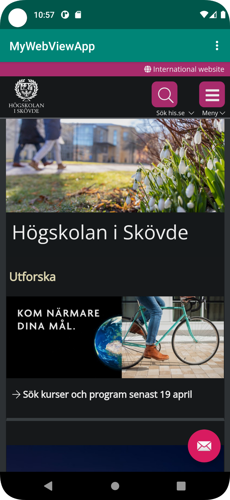
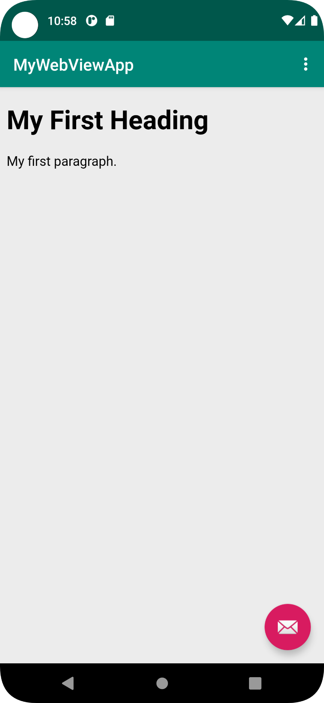

# Rapport

-Det första som gjordes var att koden nedan tillades i filen AndroidManifest.
````
    <uses-permission android:name="android.permission.INTERNET" />
````

-Därefter ändrades elementet TextView till WebView, därmed lades även ID:et "my_webview" till.
````
<WebView
    android:id="@+id/my_webview"
    android:layout_width="match_parent"
    android:layout_height="match_parent"
/>
````

-Sedan skapades en private variable i Klassen MainActivity, vilken tillsammans med det som skapats tidigare gav möjligheten att komma åt en extern webbsida (se bilder). 
-Därefter gjordes en enkel html sida (se bilder), vilken genom koden nedan, kunde även den ses i appen. 
````
myWebView.loadUrl("file:///android_asset/myPage.html");
````

-Sist användes en dropdown menu för att enkelt kunna navigera mellan både den externa och interna sidan.



